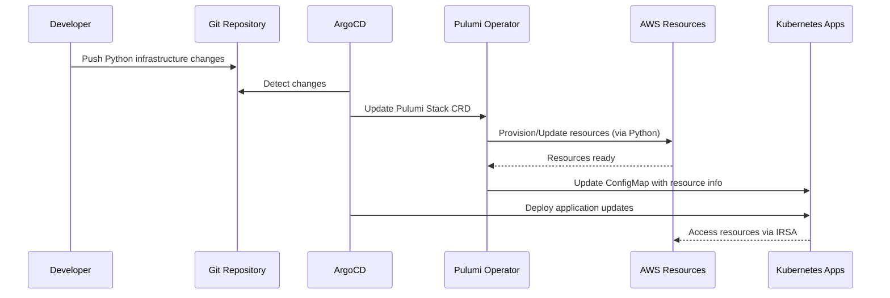

# 🎉 GitOps Infrastructure Project Summary

## 📊 Complete Project Overview

This GitOps infrastructure setup provides a **production-ready, enterprise-grade** solution that combines:

### 🏗️ **Core Technologies**
- **ArgoCD**: GitOps continuous deployment
- **Pulumi Kubernetes Operator**: Infrastructure as Code within Kubernetes
- **Python**: Modern, readable infrastructure code with Pulumi
- **Terraform Modules**: Reusable AWS infrastructure components
- **AWS Services**: S3, SQS, IAM with IRSA integration
- **Kubernetes**: Container orchestration with secure service accounts

### 📁 **Complete Project Structure**
```
gitops-ultra/                             # Root project directory
├── 📋 README.md                         # Comprehensive documentation
├── 📊 PROJECT-SUMMARY.md                # Project overview and architecture
├── ⚙️ Makefile                          # Automation commands
├── 🙈 .gitignore                        # Git ignore patterns
├── 
├── 🚀 argocd-install/                   # ArgoCD Installation
│   ├── kustomization.yaml               # Base ArgoCD installation 
│   ├── argocd-server-service.yaml       # LoadBalancer/Ingress config
│   ├── argocd-cm.yaml                   # ArgoCD configuration with Pulumi support
│   └── namespace.yaml                   # ArgoCD namespace
│   
├── ⚡ pulumi-operator/                   # Pulumi Kubernetes Operator
│   ├── kustomization.yaml               # Operator installation
│   ├── pulumi-operator-config.yaml      # Operator configuration + secrets
│   ├── infrastructure-stack.yaml        # Pulumi Stack CRD definition
│   └── namespace.yaml                   # Pulumi system namespace
│   
├── 🏁 bootstrap/                        # Bootstrap Applications 
│   └── bootstrap-apps.yaml              # Self-managing ArgoCD applications
│   
├── 🏗️ infrastructure/                   # Infrastructure as Code
│   ├── pulumi/                          # Pulumi orchestration program (Python)
│   │   ├── __main__.py                  # Main infrastructure program (Python)
│   │   ├── requirements.txt             # Python dependencies
│   │   ├── Pulumi.yaml                  # Project configuration
│   │   ├── Pulumi.dev.yaml              # Development stack config
│   │   └── venv/                        # Python virtual environment
│   └── terraform-modules/               # Reusable Terraform modules
│       ├── s3-bucket/                   # S3 with encryption + IAM
│       │   ├── main.tf                  # S3 bucket resources
│       │   ├── variables.tf             # Input variables
│       │   └── outputs.tf               # Exported values
│       └── sqs-queue/                   # SQS with DLQ + IAM
│           ├── main.tf                  # SQS queue resources  
│           ├── variables.tf             # Input variables
│           └── outputs.tf               # Exported values
│           
├── ☸️ kubernetes/                       # Kubernetes Application Manifests
│   ├── namespace.yaml                   # Application namespace
│   ├── service-account.yaml             # ServiceAccount with IRSA
│   ├── rbac.yaml                        # Role-based access control
│   ├── configmap.yaml                   # AWS resource configuration
│   ├── deployment.yaml                  # Application deployment
│   └── service.yaml                     # Service + Ingress
│   
├── 🔄 argocd/                          # ArgoCD Applications
│   ├── infrastructure-app.yaml          # Infrastructure GitOps management
│   └── kubernetes-app.yaml              # Application GitOps management
│   
├── 🛠️ scripts/                         # Automation Scripts
│   ├── setup.sh                        # Initial environment setup (Python-aware)
│   ├── update-repo-urls.sh             # Git repository URL updates
│   ├── health-check.sh                 # System health monitoring
│   ├── troubleshoot.sh                 # Component troubleshooting
│   ├── clean-uninstall.sh              # Complete cleanup
│   └── make-executable.sh              # Make scripts executable
│   
└── 📝 examples/                        # Example Configurations
    ├── README.md                        # Examples documentation
    └── production-config/               # Production environment examples
        └── Pulumi.prod.yaml             # Production stack configuration
```

## 🚀 **Deployment Architecture**

### **GitOps Flow**


### **Security Architecture**
```
┌─────────────────┐    ┌──────────────────┐    ┌─────────────────┐
│   Developer     │───▶│   Git Repository │◀───│   ArgoCD        │
│   (Python Code) │    │   (Python IaC)   │    │                 │
└─────────────────┘    └──────────────────┘    └─────────────────┘
                                                         │
                       ┌──────────────────┐              │
                       │  Pulumi Operator │◀─────────────┘
                       │  (Python Runtime)│
                       └──────────────────┘
                                │
                                ▼
┌─────────────────┐    ┌──────────────────┐    ┌─────────────────┐
│  Kubernetes     │    │   AWS Services   │    │   IRSA/IAM      │
│  Applications   │───▶│   S3, SQS        │◀───│   Secure Access │
└─────────────────┘    └──────────────────┘    └─────────────────┘
```

## 🔧 **Quick Start Commands**

### **1. Initial Setup (Python Environment)**
```bash
# Make scripts executable
chmod +x scripts/make-executable.sh && ./scripts/make-executable.sh

# Run environment setup (creates Python venv)
./scripts/setup.sh

# Update repository URLs (if needed)
./scripts/update-repo-urls.sh
```

### **2. Deploy Everything**
```bash
# Full deployment
make deploy-all

# Or step by step:
make bootstrap      # Install ArgoCD + Pulumi Operator
make deploy-infra   # Deploy AWS infrastructure (Python-based)  
make deploy-k8s     # Deploy Kubernetes applications
```

### **3. Monitor and Manage**
```bash
# Check system health
./scripts/health-check.sh

# Access ArgoCD UI
make check-argocd

# Troubleshoot issues
./scripts/troubleshoot.sh all

# Local Python development
make dev-pulumi-preview  # Preview infrastructure changes
make dev-pulumi-up       # Apply infrastructure locally
```

### **4. Cleanup (if needed)**
```bash
# Complete cleanup
./scripts/clean-uninstall.sh
```

## 🎯 **Key Features Implemented**

### ✅ **Infrastructure Management (Python-Powered)**
- **Pulumi + Terraform**: Best of both worlds - Python orchestration + HCL modules
- **GitOps Native**: All infrastructure changes via Git commits
- **Python Virtual Environment**: Isolated dependency management
- **Type Safety**: Python type hints for infrastructure code clarity
- **Automatic State Management**: Pulumi state managed within Kubernetes
- **Resource Dependencies**: Proper ordering and dependency resolution

### ✅ **Security & Compliance**
- **IRSA Integration**: No stored AWS credentials in containers
- **Least Privilege**: Minimal IAM permissions per service
- **Encrypted Storage**: S3 server-side encryption enabled
- **Network Security**: Public access blocked, proper RBAC
- **Audit Trail**: Complete history via Git + ArgoCD

### ✅ **Operational Excellence** 
- **Health Monitoring**: Comprehensive health checks and troubleshooting
- **Automated Deployment**: Zero-touch deployment pipeline
- **Rollback Capability**: Easy reversion via Git + ArgoCD
- **Multi-Environment**: Ready for dev/staging/prod separation
- **Observability**: Built-in monitoring and logging hooks

### ✅ **Developer Experience (Python-First)**
- **One-Command Setup**: `make deploy-all` for complete deployment
- **Python Virtual Environment**: Automatic dependency isolation
- **Rich Documentation**: Comprehensive guides and examples
- **Troubleshooting Tools**: Automated diagnostic scripts
- **Local Development**: Pulumi CLI integration for testing
- **IDE Support**: Type hints and code completion

## 🐍 **Python-Specific Advantages**

### **Code Quality & Maintainability**
- **Readable Infrastructure Code**: Python's clear syntax for infrastructure definitions
- **Type Safety**: Built-in type hints for better IDE support and error prevention
- **Rich Ecosystem**: Access to Python's extensive library ecosystem
- **Testing Framework**: Easy unit testing with pytest for infrastructure code
- **Debugging**: Standard Python debugging tools work with infrastructure code

### **Development Workflow**
- **Virtual Environment**: Isolated Python dependencies per project
- **Package Management**: Standard `requirements.txt` for dependency management
- **Local Testing**: Run `pulumi preview` and `pulumi up` locally before GitOps deployment
- **IDE Integration**: Full IntelliSense and error checking in Python IDEs
- **Version Control**: Treat infrastructure code like any other Python application

## 🌟 **Production Readiness Checklist**

### **Before Production Deployment:**

1. **Security Configuration**
   - [ ] Update all default passwords and secrets
   - [ ] Configure proper AWS IAM policies
   - [ ] Enable AWS CloudTrail logging
   - [ ] Set up TLS certificates for Ingresses
   - [ ] Configure network policies

2. **High Availability**
   - [ ] Multi-AZ deployment for EKS
   - [ ] Backup strategies for Pulumi state
   - [ ] Disaster recovery procedures
   - [ ] Monitoring and alerting setup

3. **Python Environment**
   - [ ] Pin Python package versions in requirements.txt
   - [ ] Set up CI/CD for Python code quality checks
   - [ ] Configure automated testing for infrastructure code
   - [ ] Document Python environment setup procedures

4. **Operational Procedures**
   - [ ] Change management process
   - [ ] Incident response procedures  
   - [ ] Backup and restore testing
   - [ ] Security scanning integration

## 🔮 **Next Steps & Extensions**

### **Immediate Enhancements**
- Add **Helm charts** for complex applications
- Integrate **External Secrets Operator** for secret management
- Set up **Prometheus + Grafana** for monitoring
- Add **Cert-Manager** for TLS certificate automation

### **Python-Specific Enhancements**
- **Unit Testing**: Add pytest tests for infrastructure functions
- **Code Quality**: Integrate black, flake8, mypy for code quality
- **Documentation**: Auto-generate docs from Python docstrings
- **Custom Modules**: Create reusable Python infrastructure modules

### **Advanced Features**
- **Multi-cluster** GitOps with ArgoCD ApplicationSets
- **Progressive delivery** with Argo Rollouts
- **Policy enforcement** with OPA Gatekeeper
- **Service mesh** integration with Istio

### **Enterprise Integration**
- **OIDC/SAML** authentication for ArgoCD
- **RBAC** integration with enterprise identity systems
- **Compliance** scanning and reporting
- **Cost optimization** and resource governance

## 🎉 **Success! You Now Have:**

✨ **A complete, production-ready GitOps infrastructure** powered by **Python** that automatically:

1. **Provisions AWS resources** (S3, SQS, IAM) via Terraform modules orchestrated by Python
2. **Manages infrastructure** via Pulumi Python programs within Kubernetes  
3. **Deploys applications** via ArgoCD from Git
4. **Secures access** via IRSA (no stored credentials)
5. **Monitors health** with comprehensive tooling
6. **Enables scaling** for multiple environments
7. **Provides excellent developer experience** with Python's readable syntax and tooling

This setup represents **modern infrastructure as code best practices** with:
- **Python-first** development experience
- **Enterprise-grade** security and operational excellence
- **Cloud-native** GitOps workflows
- **Production-ready** from day one

**🐍🚀 Ready to deploy with Python power? Run `make deploy-all` and watch the magic happen!**
