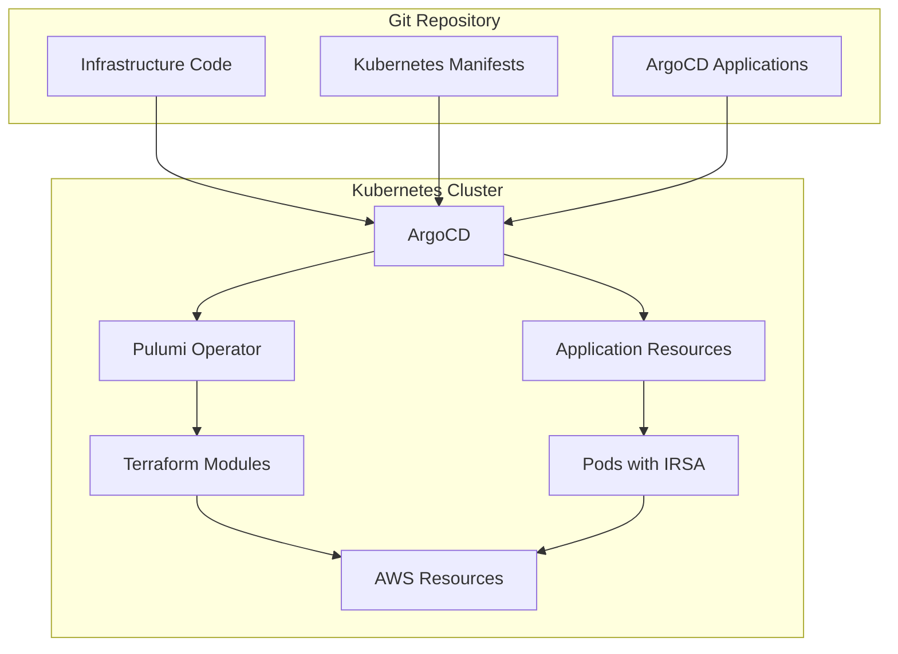

# GitOps Infrastructure with ArgoCD, Pulumi Operator, and Terraform

This repository provides a complete **GitOps-ready infrastructure** that combines:

- 🚀 **ArgoCD** for GitOps continuous deployment
- ⚡ **Pulumi Kubernetes Operator** for infrastructure management within Kubernetes
- 🏗️ **Terraform modules** for reusable AWS resource definitions
- ☸️ **Kubernetes manifests** for application deployment
- 🔐 **IRSA (IAM Roles for Service Accounts)** for secure AWS access

## 🏗️ Architecture Overview



## 📁 Repository Structure

```
├── argocd-install/              # ArgoCD installation via Kustomize
│   ├── kustomization.yaml       # ArgoCD base installation
│   ├── argocd-server-service.yaml  # Service/Ingress configuration
│   └── argocd-cm.yaml          # ArgoCD configuration
├── pulumi-operator/             # Pulumi Kubernetes Operator
│   ├── kustomization.yaml       # Operator installation
│   ├── pulumi-operator-config.yaml  # Operator configuration
│   └── infrastructure-stack.yaml   # Pulumi Stack CRD
├── bootstrap/                   # Bootstrap ArgoCD applications
│   └── bootstrap-apps.yaml      # Initial ArgoCD apps for self-management
├── infrastructure/              # Infrastructure as Code
│   ├── pulumi/                  # Pulumi program (Python)
│   │   ├── __main__.py         # Main infrastructure program
│   │   ├── requirements.txt    # Python dependencies
│   │   ├── Pulumi.yaml         # Project configuration
│   │   └── Pulumi.*.yaml       # Stack configurations
│   └── terraform-modules/       # Reusable Terraform modules
│       ├── s3-bucket/          # S3 bucket with security
│       └── sqs-queue/          # SQS queue with DLQ
├── kubernetes/                  # Kubernetes application manifests
│   ├── namespace.yaml          # Application namespace
│   ├── service-account.yaml    # ServiceAccount with IRSA
│   ├── deployment.yaml         # Application deployment
│   └── service.yaml           # Service and Ingress
├── argocd/                     # ArgoCD application definitions
│   ├── infrastructure-app.yaml # Infrastructure GitOps
│   └── kubernetes-app.yaml     # Application GitOps
├── scripts/                    # Automation scripts
│   ├── setup.sh               # Environment setup
│   ├── health-check.sh        # System health monitoring
│   └── troubleshoot.sh        # Component troubleshooting
├── Makefile                    # Automation commands
└── README.md                   # This documentation
```

## 🚀 Quick Start

### Prerequisites

- **Python 3.7+** with pip
- **Kubernetes cluster** (EKS recommended for IRSA support)
- **kubectl** configured for your cluster
- **AWS CLI** configured with appropriate permissions
- **Pulumi CLI** (for local development and testing)
- **Terraform** (for module validation)

### 1️⃣ Bootstrap Everything

```bash
# Clone and enter the repository
git clone <your-repo-url>
cd <your-repo>

# Install dependencies and validate configuration
make install-deps
make validate

# Bootstrap ArgoCD and Pulumi Operator
make bootstrap
```

### 2️⃣ Deploy Infrastructure and Applications

```bash
# Deploy everything
make deploy-all

# Or deploy step by step
make deploy-infra    # Infrastructure via Pulumi Operator
make deploy-k8s      # Applications via ArgoCD
```

### 3️⃣ Access ArgoCD UI

```bash
# Get ArgoCD access details
make check-argocd

# For local access (port forwarding)
make dev-argocd-forward
# Then visit: https://localhost:8080
```

### 4️⃣ Monitor Status

```bash
# Check overall status
make status

# Follow infrastructure logs
make dev-logs-infrastructure

# Follow ArgoCD logs
make dev-logs-argocd
```

## 🔄 GitOps Workflow

### Infrastructure Changes
1. **Modify Pulumi program** in `infrastructure/pulumi/__main__.py`
2. **Commit and push** to Git repository
3. **ArgoCD detects changes** and updates Pulumi Stack CRD
4. **Pulumi Operator executes** infrastructure changes
5. **AWS resources** are created/updated automatically

### Application Changes
1. **Modify Kubernetes manifests** in `kubernetes/`
2. **Commit and push** to Git repository
3. **ArgoCD syncs changes** automatically
4. **Applications** are updated with zero downtime

### Configuration Changes
1. **Update configurations** in respective directories
2. **ArgoCD applications** sync based on sync policies
3. **Observe changes** via ArgoCD UI or CLI

## 🛠️ Components Deep Dive

### ArgoCD Installation
- **Kustomize-based** installation for easy customization
- **Ingress/LoadBalancer** support for external access
- **Custom resource health checks** for Pulumi Stacks
- **RBAC** configured for team access

### Pulumi Kubernetes Operator
- **Manages Pulumi programs** as Kubernetes Custom Resources
- **Git-based** source control integration
- **Secret management** for AWS credentials and Pulumi state
- **Resource lifecycle** management within Kubernetes

### Infrastructure Components (Python-based)
- **S3 Bucket**: Versioned, encrypted storage with IAM policies
- **SQS Queue**: Message processing with dead letter queue
- **IAM Roles**: IRSA-compatible roles for secure K8s access
- **ConfigMaps**: Dynamic configuration injection

### Security Features
- **IRSA**: No stored AWS credentials in containers
- **Least Privilege**: Minimal IAM permissions per service
- **Encrypted Storage**: S3 server-side encryption
- **Network Policies**: Pod-to-pod communication controls
- **Secret Management**: Kubernetes secrets for sensitive data

## ⚙️ Configuration

### Environment Configuration

Update `infrastructure/pulumi/Pulumi.dev.yaml`:
```yaml
config:
  aws:region: us-west-2
  project:prefix: myapp-dev
  kubernetes:namespace: myapp-dev
```

### Python Virtual Environment

The Pulumi program uses a Python virtual environment for dependency isolation:

```bash
# Virtual environment is created automatically by setup script
cd infrastructure/pulumi

# Activate manually if needed
source venv/bin/activate

# Install/update dependencies
pip install -r requirements.txt

# Local Pulumi development
pulumi preview  # Preview changes
pulumi up       # Apply changes
pulumi destroy  # Cleanup resources
```

### AWS Credentials

For the Pulumi Operator, configure AWS access via:

1. **IRSA (Recommended for EKS)**:
   ```yaml
   # In pulumi-operator/infrastructure-stack.yaml
   spec:
     envSecrets:
     - secret: aws-irsa-credentials
   ```

2. **AWS Credentials Secret**:
   ```bash
   kubectl create secret generic aws-credentials \
     --from-literal=AWS_ACCESS_KEY_ID=your-key \
     --from-literal=AWS_SECRET_ACCESS_KEY=your-secret \
     -n pulumi-system
   ```

### Repository Configuration

Update Git repository URLs in:
- `bootstrap/bootstrap-apps.yaml`
- `argocd/infrastructure-app.yaml`
- `argocd/kubernetes-app.yaml`
- `pulumi-operator/infrastructure-stack.yaml`

## 📊 Monitoring and Observability

### ArgoCD Monitoring
- **Application health** via ArgoCD UI
- **Sync status** and drift detection
- **Resource-level** health checks

### Infrastructure Monitoring
- **Pulumi Stack status** via Kubernetes CRDs
- **AWS CloudWatch** integration
- **Cost tracking** via AWS billing

### Application Monitoring
- **Kubernetes metrics** via kubectl/dashboard
- **Health checks** (liveness/readiness probes)
- **Log aggregation** via your logging solution

## 🔧 Customization

### Adding New AWS Resources

1. **Create new Terraform module** in `infrastructure/terraform-modules/`
2. **Reference module** in `infrastructure/pulumi/__main__.py`
3. **Update IAM policies** for service account access
4. **Add resource info** to ConfigMap

### Scaling Applications

1. **Update replica count** in `kubernetes/deployment.yaml`
2. **Adjust resource limits** based on requirements
3. **Configure HPA** for automatic scaling
4. **Update ingress** for load balancing

### Multi-Environment Setup

1. **Create new Pulumi stacks**:
   ```bash
   cd infrastructure/pulumi
   source venv/bin/activate
   pulumi stack init prod
   pulumi config set aws:region us-east-1
   pulumi config set project:prefix myapp-prod
   ```

2. **Create environment-specific** ArgoCD applications
3. **Use Git branches** for environment promotion

## 🚨 Troubleshooting

### Common Issues

**ArgoCD Applications Not Syncing**
```bash
# Check application status
kubectl describe app myapp-infrastructure -n argocd

# Check ArgoCD logs
kubectl logs -f deployment/argocd-application-controller -n argocd
```

**Pulumi Stack Failures**
```bash
# Check stack status
kubectl get stack myapp-infrastructure -n pulumi-system -o yaml

# Check operator logs
kubectl logs -f deployment/pulumi-operator -n pulumi-system
```

**Python Dependencies Issues**
```bash
# Recreate virtual environment
cd infrastructure/pulumi
rm -rf venv
python3 -m venv venv
source venv/bin/activate
pip install -r requirements.txt
```

**IRSA Not Working**
```bash
# Verify service account annotations
kubectl describe sa myapp-dev-service-account -n myapp-dev

# Check pod AWS credentials
kubectl exec -it deployment/myapp-dev-deployment -n myapp-dev -- env | grep AWS
```

### Debug Commands

```bash
# Comprehensive status check
make status

# Validate all configurations
make validate

# Check ArgoCD access
make check-argocd

# Port forward for local ArgoCD access
make dev-argocd-forward

# Local Pulumi development
make dev-pulumi-preview  # Preview infrastructure changes
make dev-pulumi-up       # Apply infrastructure changes
make dev-pulumi-destroy  # Destroy infrastructure
```

### Automated Troubleshooting

```bash
# Run health checks
./scripts/health-check.sh

# Component-specific troubleshooting
./scripts/troubleshoot.sh argocd      # ArgoCD issues
./scripts/troubleshoot.sh pulumi     # Pulumi Operator issues
./scripts/troubleshoot.sh aws        # AWS resource issues
./scripts/troubleshoot.sh irsa       # IRSA configuration issues
./scripts/troubleshoot.sh all        # Comprehensive check
```

## 🧹 Cleanup

```bash
# Clean up everything
make clean

# Or use the comprehensive cleanup script
./scripts/clean-uninstall.sh

# This will remove:
# - All ArgoCD applications
# - Kubernetes resources
# - ArgoCD installation
# - Pulumi Operator
# - Optionally AWS resources
```

## 🔄 Development Workflow

### Local Development
1. **Test infrastructure changes** locally with Pulumi CLI
2. **Validate Kubernetes manifests** with `kubectl apply --dry-run`
3. **Use feature branches** for testing changes
4. **Review ArgoCD sync** before merging

### Production Deployment
1. **Use separate Git branches** for environments
2. **Enable manual sync** for production ArgoCD apps
3. **Implement approval workflows** for infrastructure changes
4. **Monitor deployments** via ArgoCD UI

## 🐍 Python Development

### Code Structure
- **`__main__.py`**: Main Pulumi program entry point
- **Virtual environment**: Isolated Python dependencies
- **Type hints**: Enhanced code clarity and IDE support
- **Error handling**: Robust error management for infrastructure operations

### Best Practices
- **Use virtual environment** for dependency isolation
- **Pin dependency versions** in requirements.txt
- **Test locally** before committing changes
- **Use Pulumi's** built-in state management
- **Follow Python** coding standards (PEP 8)

## 🤝 Contributing

1. **Fork the repository**
2. **Create feature branch** (`git checkout -b feature/amazing-feature`)
3. **Setup Python environment** (`make install-deps`)
4. **Test changes** with `make validate`
5. **Commit changes** (`git commit -m 'Add amazing feature'`)
6. **Push to branch** (`git push origin feature/amazing-feature`)
7. **Open Pull Request**

## 📚 Additional Resources

- [ArgoCD Documentation](https://argo-cd.readthedocs.io/)
- [Pulumi Kubernetes Operator](https://github.com/pulumi/pulumi-kubernetes-operator)
- [Pulumi Python Documentation](https://www.pulumi.com/docs/intro/languages/python/)
- [AWS IAM Roles for Service Accounts](https://docs.aws.amazon.com/eks/latest/userguide/iam-roles-for-service-accounts.html)
- [Terraform AWS Provider](https://registry.terraform.io/providers/hashicorp/aws/latest/docs)

## 📄 License

This project is licensed under the MIT License - see the [LICENSE](LICENSE) file for details.
