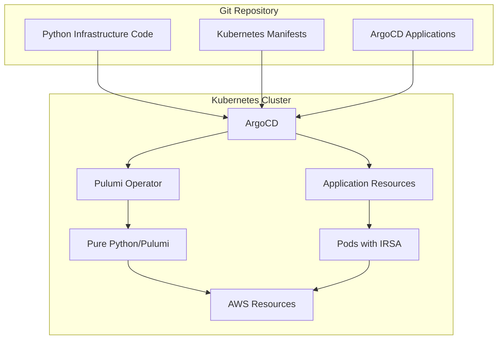

# GitOps Infrastructure with ArgoCD, Pulumi Operator, and Pure Python

This repository provides a complete **GitOps-ready infrastructure** that combines:

- 🚀 **ArgoCD** for GitOps continuous deployment
- ⚡ **Pulumi Kubernetes Operator** for infrastructure management within Kubernetes
- 🐍 **Pure Python Pulumi** for readable, maintainable infrastructure code
- ☸️ **Kubernetes manifests** for application deployment
- 🔐 **IRSA (IAM Roles for Service Accounts)** for secure AWS access

## 🏗️ Architecture Overview



## 📁 Repository Structure

```
├── argocd-install/              # ArgoCD installation via Kustomize
├── pulumi-operator/             # Pulumi Kubernetes Operator
├── bootstrap/                   # Bootstrap ArgoCD applications
├── infrastructure/              # Infrastructure as Code
│   └── pulumi/                  # Pure Python Pulumi program
│       ├── __main__.py         # Main infrastructure program (Python)
│       ├── requirements.txt    # Python dependencies
│       ├── Pulumi.yaml         # Project configuration
│       └── venv/               # Python virtual environment
├── kubernetes/                  # Kubernetes application manifests
├── argocd/                     # ArgoCD application definitions
├── scripts/                    # Automation scripts
├── PYTHON-TROUBLESHOOTING.md   # Python-specific troubleshooting guide
├── Makefile                    # Automation commands
└── README.md                   # This documentation
```

## 🚀 Quick Start

### Prerequisites

- **Python 3.7+** with pip
- **Kubernetes cluster** (EKS recommended for IRSA support)
- **kubectl** configured for your cluster
- **AWS CLI** configured with appropriate permissions
- **Pulumi CLI** (for local development and testing)

### 1️⃣ Install Dependencies

```bash
# Install all Python dependencies (creates virtual environment)
make install-deps

# Test the installation
make test-pulumi
```

### 2️⃣ Bootstrap Everything

```bash
# Validate configuration
make validate

# Bootstrap ArgoCD and Pulumi Operator
make bootstrap
```

### 3️⃣ Deploy Infrastructure and Applications

```bash
# Deploy everything
make deploy-all

# Or deploy step by step
make deploy-infra    # Infrastructure via Pulumi Operator
make deploy-k8s      # Applications via ArgoCD
```

### 4️⃣ Access ArgoCD UI

```bash
# Get ArgoCD access details
make check-argocd

# For local access (port forwarding)
make dev-argocd-forward
# Then visit: https://localhost:8080
```

## 🔄 GitOps Workflow

### Infrastructure Changes
1. **Modify Python code** in `infrastructure/pulumi/__main__.py`
2. **Test locally** with `make dev-pulumi-preview`
3. **Commit and push** to Git repository
4. **ArgoCD detects changes** and updates Pulumi Stack CRD
5. **Pulumi Operator executes** Python infrastructure code
6. **AWS resources** are created/updated automatically

### Application Changes
1. **Modify Kubernetes manifests** in `kubernetes/`
2. **Commit and push** to Git repository
3. **ArgoCD syncs changes** automatically
4. **Applications** are updated with zero downtime

## 🛠️ Pure Python Infrastructure

### What's Included
- **S3 Bucket**: Versioned, encrypted storage with IAM policies
- **SQS Queue**: Message processing with dead letter queue
- **IAM Roles**: IRSA-compatible roles for secure K8s access
- **Kubernetes Resources**: Namespace, ServiceAccount, ConfigMap

### Advantages of Python Implementation
- **Readable Code**: Clean Python syntax for infrastructure
- **Type Safety**: Full IDE support with type hints
- **No External Dependencies**: Pure Pulumi without Terraform modules
- **Better Error Handling**: Rich Python error reporting
- **Easy Testing**: Standard Python testing frameworks

### Example Infrastructure Code
```python
# Create S3 bucket with encryption
s3_bucket = aws.s3.Bucket(
    "data-bucket",
    bucket=f"{prefix}-data-bucket",
    tags=common_tags
)

s3_encryption = aws.s3.BucketServerSideEncryptionConfigurationV2(
    "bucket-encryption",
    bucket=s3_bucket.id,
    rules=[aws.s3.BucketServerSideEncryptionConfigurationV2RuleArgs(
        apply_server_side_encryption_by_default=aws.s3.BucketServerSideEncryptionConfigurationV2RuleApplyServerSideEncryptionByDefaultArgs(
            sse_algorithm="AES256"
        )
    )]
)
```

## ⚙️ Configuration

### Environment Configuration

Update `infrastructure/pulumi/Pulumi.dev.yaml`:
```yaml
config:
  aws:region: us-west-2
  project:prefix: myapp-dev
  kubernetes:namespace: myapp-dev
```

### Python Development

```bash
# Activate virtual environment
cd infrastructure/pulumi
source venv/bin/activate

# Install/update dependencies
pip install -r requirements.txt

# Local development commands
pulumi preview  # Preview changes
pulumi up       # Apply changes  
pulumi destroy  # Cleanup resources

# Or use make commands
make dev-pulumi-preview
make dev-pulumi-up
make dev-pulumi-destroy
```

## 🚨 Troubleshooting

### Quick Fixes for Common Issues

**Package Installation Error**:
```bash
# The pulumi-terraform dependency issue has been fixed
make install-deps  # Should work now
```

**Virtual Environment Issues**:
```bash
cd infrastructure/pulumi
rm -rf venv  # Remove corrupted environment
make install-deps  # Recreate everything
```

**Test Your Installation**:
```bash
make test-pulumi  # Comprehensive test
```

### Detailed Troubleshooting
See **[PYTHON-TROUBLESHOOTING.md](PYTHON-TROUBLESHOOTING.md)** for comprehensive troubleshooting guide including:
- Package installation errors
- Virtual environment issues
- Pulumi configuration problems
- EKS/IRSA setup issues
- Development workflow tips

### Debug Commands

```bash
# Test installation
make test-pulumi

# Comprehensive status check
make status

# Validate all configurations
make validate

# Component-specific troubleshooting
./scripts/troubleshoot.sh python     # Python/Pulumi issues
./scripts/troubleshoot.sh aws        # AWS resource issues
./scripts/troubleshoot.sh all        # Comprehensive check
```

## 📊 Monitoring and Observability

### ArgoCD Monitoring
- **Application health** via ArgoCD UI
- **Sync status** and drift detection
- **Resource-level** health checks

### Infrastructure Monitoring
- **Pulumi Stack status** via Kubernetes CRDs
- **AWS CloudWatch** integration
- **Cost tracking** via AWS billing

### Application Monitoring
- **Kubernetes metrics** via kubectl/dashboard
- **Health checks** (liveness/readiness probes)
- **Log aggregation** via your logging solution

## 🔧 Customization

### Adding New AWS Resources

1. **Add resources** in `infrastructure/pulumi/__main__.py`:
```python
# Example: Add RDS database
rds_instance = aws.rds.Instance(
    "database",
    instance_class="db.t3.micro",
    engine="postgres",
    # ... other configuration
)
```

2. **Export outputs** for Kubernetes:
```python
pulumi.export("database_endpoint", rds_instance.endpoint)
```

3. **Update ConfigMap** to include new resource info

### Multi-Environment Setup

```bash
# Create production stack
cd infrastructure/pulumi
source venv/bin/activate
pulumi stack init prod
pulumi config set aws:region us-east-1
pulumi config set project:prefix myapp-prod
```

## 🧹 Cleanup

```bash
# Clean up everything
make clean

# Or use the comprehensive cleanup script
./scripts/clean-uninstall.sh
```

## 🐍 Python Development Best Practices

### Code Quality
- **Type Hints**: Use type annotations for better IDE support
- **Documentation**: Add docstrings to functions
- **Testing**: Use pytest for infrastructure tests
- **Formatting**: Use black for code formatting

### Virtual Environment Management
- **Always activate** virtual environment before Pulumi commands
- **Pin versions** in requirements.txt for reproducibility
- **Separate environments** for different projects

### Development Workflow
```bash
# 1. Activate environment
cd infrastructure/pulumi && source venv/bin/activate

# 2. Make changes to __main__.py

# 3. Test syntax
python -m py_compile __main__.py

# 4. Preview changes
pulumi preview

# 5. Commit and let GitOps deploy
git add . && git commit -m "Update infrastructure"
```

## 🤝 Contributing

1. **Fork the repository**
2. **Create feature branch** (`git checkout -b feature/amazing-feature`)
3. **Setup Python environment** (`make install-deps`)
4. **Test changes** (`make test-pulumi && make validate`)
5. **Commit changes** (`git commit -m 'Add amazing feature'`)
6. **Push to branch** (`git push origin feature/amazing-feature`)
7. **Open Pull Request**

## 📚 Additional Resources

- [Pulumi Python Documentation](https://www.pulumi.com/docs/intro/languages/python/)
- [Pulumi AWS Provider](https://www.pulumi.com/registry/packages/aws/)
- [ArgoCD Documentation](https://argo-cd.readthedocs.io/)
- [Pulumi Kubernetes Operator](https://github.com/pulumi/pulumi-kubernetes-operator)
- [AWS IAM Roles for Service Accounts](https://docs.aws.amazon.com/eks/latest/userguide/iam-roles-for-service-accounts.html)

## 📄 License

This project is licensed under the MIT License - see the [LICENSE](LICENSE) file for details.

---

**🐍🚀 Ready to deploy Python-powered GitOps infrastructure? Run `make install-deps && make deploy-all`!**
